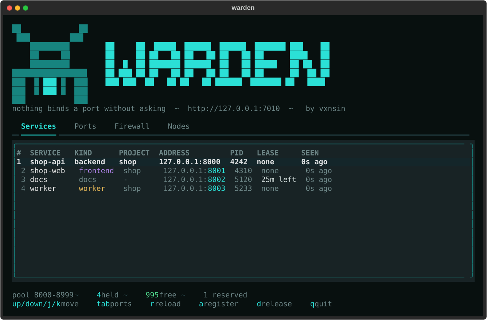
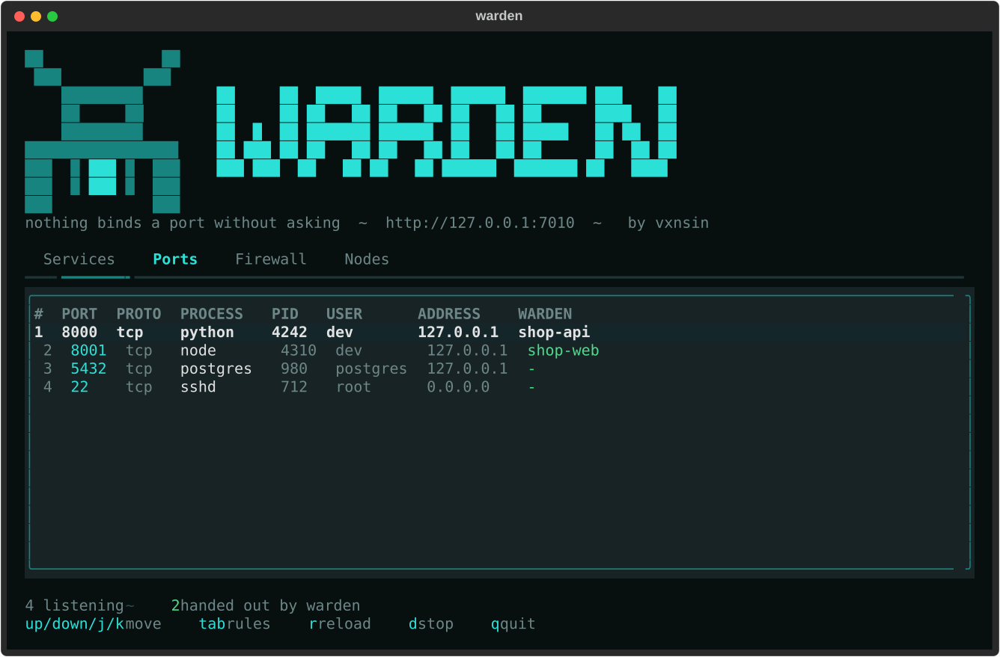

**Nothing binds a port without asking.**

One place that decides which local port a service runs on. Services register
under a name, say what they are, and get a port back. The same name keeps the
same port across restarts, so a backend never wakes up on the port its frontend
grabbed while it was down.



## What is on port 3000?

Not every port on a machine came from a registry. `warden ports` shows every
socket the operating system reports, whether warden handed it out or not, and
`warden kill` frees one:

```sh
$ warden ports --port 3000
PORT  PROTO  PROCESS   PID    USER              ADDRESS  WARDEN
3000  tcp    node.exe  25084  dev               0.0.0.0  -

$ warden kill 3000
Stop node.exe (25084) on port 3000? [y/N]: y
stopped node.exe (25084)
```

Neither needs a warden running anywhere — they read the machine directly. The
WARDEN column names the service whenever the port did come from the registry.

Sockets owned by another user appear without a process name; run warden as
administrator on Windows, or with `sudo` on Linux and macOS, to see those too.

## Why

On a machine that runs a handful of projects, ports are picked by hand and
written down in three places: a `.env`, a `vite.config.ts`, and someone's memory.
Two services eventually pick 8080 and the second one fails to start — or worse,
starts and talks to the wrong neighbour.

`warden` replaces that with a registry:

- every service asks for a port instead of hardcoding one
- ports come from a single pool, so two services cannot collide
- a service keeps its port across restarts
- ports already occupied by something outside the registry are skipped
- `warden ls` answers "what is running on 8003?"

## Install

```sh
git clone https://github.com/vxnsin/warden
cd warden
uv sync
uv run warden
```

To get `warden` as a command of its own, without the `uv run` in front:

```sh
uv tool install .
```

It is not on PyPI yet, so `uv tool install warden` by name does not work — see
[#1](https://github.com/vxnsin/warden/issues/1).

## Quick start

Start the registry — it listens on `127.0.0.1:7010` and hands out `8000-8999`:

```sh
warden serve
```

Claim a port:

```sh
$ warden register shop-api --kind backend --project shop
8000
$ warden register shop-web --kind frontend --project shop
8001
```

See who holds what:

```sh
$ warden ls
SERVICE   KIND      PROJECT  ADDRESS         PID
shop-api  backend   shop     127.0.0.1:8000  -
shop-web  frontend  shop     127.0.0.1:8001  -
```

Give a port back:

```sh
warden release shop-web
```

## Asking for a particular port

Two different wishes, two different fields:

```sh
# "I would like 3000, but anything free will do."
warden register shop-web --kind frontend --preferred-port 3000

# "It has to be 3000, this port is hardcoded in a config I cannot change."
warden register legacy-crm --kind backend --require-port 3000
```

`--preferred-port` falls back to the pool when the port is taken, reserved, or
already in use. `--require-port` fails with `409` instead. Both may name a port
outside the pool, which is how a legacy service on `3000` joins the registry.

## Dashboard

```sh
warden tui
```

Two live tables, refreshed every two seconds. `tab` swaps between what warden
handed out and what is actually listening:



| Key | Action |
| --- | --- |
| `↑` `↓` `j` `k` | Move |
| `tab` | Switch between services and ports |
| `r` | Reload now |
| `d` | Release the service, or stop the process |
| `q` | Quit |

The dashboard reads both tables from the warden it is pointed at, so the ports
it lists are the ones on *that* machine. Stopping a process from here goes
through the API and needs `WARDEN_ALLOW_KILL` (see below); `warden kill` on the
command line is local and always works.

## From Python

The package ships a client, so a service can ask for its own port at startup:

```python
import uvicorn
from warden import register

port = register("shop-api", kind="backend", project="shop")
uvicorn.run(app, port=port)
```

Look up a neighbour instead of hardcoding its address:

```python
from warden import WardenClient

with WardenClient() as client:
    backend = client.lookup("shop-api")
    base_url = f"http://{backend.address}"
```

For short-lived processes, `reserve` hands the port back on the way out:

```python
from warden import reserve

with reserve("test-fixture", kind="worker") as port:
    run_server(port)
```

## From the shell

```sh
PORT=$(warden register shop-api --kind backend)
exec ./server --port "$PORT"
```

## HTTP API

Base URL `http://127.0.0.1:7010`. Interactive docs at `/docs`.

| Method | Path | Purpose |
| --- | --- | --- |
| `GET` | `/health` | Liveness and number of registrations |
| `GET` | `/v1/pool` | Pool size, allocated, free, reserved |
| `GET` | `/v1/services` | List registrations, filter by `project` and `kind` |
| `POST` | `/v1/services` | Register a service, `201` when new, `200` when renewed |
| `GET` | `/v1/services/{name}` | Look up one service |
| `POST` | `/v1/services/{name}/heartbeat` | Extend a lease |
| `DELETE` | `/v1/services/{name}` | Release a port |
| `GET` | `/v1/listeners` | Every socket bound on that machine |
| `DELETE` | `/v1/listeners/{pid}` | Stop a process, off unless `WARDEN_ALLOW_KILL` |
| `POST` | `/v1/nodes` | A warden announces itself, cluster token |
| `GET` | `/v1/nodes` | Every warden this one knows |
| `DELETE` | `/v1/nodes/{name}` | Forget a warden |

```sh
curl -s localhost:7010/v1/services \
  -H 'content-type: application/json' \
  -d '{"name": "shop-api", "kind": "backend", "project": "shop"}'
```

```json
{
  "name": "shop-api",
  "kind": "backend",
  "project": "shop",
  "host": "127.0.0.1",
  "port": 8000,
  "pid": null,
  "meta": {},
  "ttl": null,
  "created_at": "2026-08-31T12:00:00Z",
  "updated_at": "2026-08-31T12:00:00Z",
  "expires_at": null
}
```

Failures come back as `{"detail": "..."}` with `404` for an unknown service,
`409` when a required port is taken, and `503` when the pool is full.

## How a port is chosen

1. A registration that already exists keeps its port, unless another
   registration has taken it meanwhile.
2. `require_port` is granted if it is free and refused with `409` if it is not.
3. `preferred_port` is granted if it is free, and otherwise quietly gives way to
   the pool.
4. Otherwise the lowest free port in the pool wins.
5. Before a fresh port is handed out it is tested for an existing listener, so
   anything started outside the registry is skipped. A service keeping its own
   port is not probed, since it may still be bound to it. `--no-probe` turns the
   test off entirely.

Ports are tracked per host, so `10.0.0.5:8000` and `127.0.0.1:8000` are two
different endpoints.

## Leases

A registration lasts until it is released. Pass `ttl` to make it expire instead —
useful for test fixtures and CI, where nothing gets the chance to clean up:

```sh
warden register ci-runner --kind worker --ttl 600
```

`POST /v1/services/{name}/heartbeat` pushes the expiry out again. Sent without a
`ttl` it renews the lease the service registered with, so a heartbeat can never
turn a lease into a permanent registration by accident. Expired registrations are
dropped on the next request that touches the registry.

## More than one machine

A warden can report to another one. The hub then knows every node, what range it
hands out and whether it is still answering:

```sh
# on the hub
WARDEN_CLUSTER_TOKEN=... warden serve

# on each other machine
WARDEN_CLUSTER_TOKEN=... \
WARDEN_NODE=build-01 \
WARDEN_UPSTREAM=http://hub:7010 \
WARDEN_ADVERTISE=http://build-01:7010 \
  warden serve
```

```sh
$ warden nodes --url http://hub:7010
NODE      URL                    POOL       VERSION  STATUS  LAST SEEN
build-01  http://build-01:7010   9000-9099  0.1.0    online  4s ago
web-02    http://web-02:7010     9000-9099  0.1.0    stale   6m ago
```

**Every node owns its own ports.** The hub is a directory, never the owner, and
that is not a detail: whether a port is free can only be answered on the machine
itself, by trying to bind it. Move the decision to the hub and warden loses the
one thing that makes it more than a spreadsheet — and nothing would start
anywhere while the hub is down.

So a node that cannot reach its hub carries on handing out ports and says so in
its log. A node that stops reporting is shown as `stale` rather than dropped: a
server that is not answering is a fact worth seeing, and
`warden nodes --forget build-01` removes it once it is gone for good.

`WARDEN_ADVERTISE` is the address the hub should use. Leave it out only when both
run on the same machine; a node pointing at a hub elsewhere while advertising
`127.0.0.1` is refused at startup rather than left to fail silently later.

Wardens authenticate to each other with `WARDEN_CLUSTER_TOKEN`, which is separate
from the `WARDEN_TOKEN` a person uses. Announcing takes the cluster token;
reading the fleet takes the human one.

## Configuration

Every setting is an environment variable prefixed `WARDEN_`, or a line in a
`.env` file next to the process.

| Variable | Default | Meaning |
| --- | --- | --- |
| `WARDEN_HOST` | `127.0.0.1` | Interface the registry listens on |
| `WARDEN_PORT` | `7010` | Port the registry listens on |
| `WARDEN_POOL_START` | `8000` | First port that may be handed out |
| `WARDEN_POOL_END` | `8999` | Last port that may be handed out |
| `WARDEN_RESERVED` | empty | Ports to keep out, e.g. `8080,8443,9000-9010` |
| `WARDEN_DATABASE` | platform data dir | SQLite file holding the registry |
| `WARDEN_PROBE` | `true` | Test ports for existing listeners |
| `WARDEN_ALLOW_KILL` | `false` | Let the API stop processes |
| `WARDEN_TOKEN` | empty | Require `Authorization: Bearer <token>` |
| `WARDEN_URL` | `http://127.0.0.1:7010` | Registry the client and CLI talk to |
| `WARDEN_NODE` | machine name | This warden's name in the fleet |
| `WARDEN_UPSTREAM` | empty | Hub to report to; empty means it is one |
| `WARDEN_ADVERTISE` | from host and port | Address the hub should use to reach it |
| `WARDEN_CLUSTER_TOKEN` | empty | Shared secret between wardens |
| `WARDEN_NODE_TTL` | `90` | Seconds a node's entry stays fresh |

The registry binds to loopback and has no authentication by default. Set a token
before binding it to anything else.

`WARDEN_ALLOW_KILL` is off on purpose. A warden reachable from the network would
otherwise let anyone holding the token end processes on that machine, which is a
much bigger thing to hand out than a port number. `warden kill` on the command
line is unaffected: it acts locally and never asks the API.

## Colours

The palette lives in `warden/theme.py`, so the dashboard, the CLI and this page
never drift apart.

| Role | Colour | |
| --- | --- | --- |
| Ground | `#08100f` | sculk black |
| Surface | `#0e1a1c` | panels and table |
| Border | `#1e3538` | |
| Text | `#d9e4e2` | |
| Muted | `#6d8687` | labels, empty cells |
| Live | `#2be0d6` | ports, focus, the banner |
| `frontend` | `#a87fe0` | |
| `worker` | `#e0b457` | also a lease about to run out |
| `database` | `#4fd98c` | also free capacity |
| Conflict | `#e5544b` | expired leases, errors |

## Development

```sh
uv sync --all-groups
uv run pytest
uv run ruff check .
```

## License

MIT
